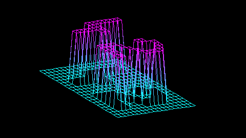

# FdF

Render a 3D wireframe of a heightmap (a `.fdf` file) in a 2D window using an isometric projection.  
This is the classic **42** project implemented in **C** with **MiniLibX**, using my own **libft** as submodule.

<p align="center">
  <a href="assets/preview@2x.png">
    
  </a>
</p>

---

## ✨ Features

- Read `.fdf` heightmap files (space‑separated **z** values).
- Project 3D points to 2D (to apply isometric view use 'S' key).
- Interactive view: zoom, rotate, move, adjust Z‑scale (altitude), quit.
- Simple pixel plotting and line drawing (Bresenham‑style) with basic color handling.
- Clean repo layout with `src/`, `include/`, `lib/` and a portable **Makefile**.

---

## 🔌 Submodules

This repo uses two git submodules:

- **libft** → `lib/libft` 
- **minilibx-linux** → `lib/minilibx-linux` (MiniLibX is a small graphics lib used in 42 projects - an abstraction of the “X Window System” for Unix platforms)

### Clone with submodules

```bash
git clone --recurse-submodules https://github.com/grignetta/42_fdf.git fdf
# or, if you already cloned:
git submodule update --init --recursive
```

### Update submodules later

```bash
git submodule update --remote --merge
```

---

## 🧱 Dependencies (Linux)

MiniLibX (Linux) needs X11 development packages. On Debian/Ubuntu:

```bash
sudo apt-get update
sudo apt-get install -y build-essential libx11-dev libxext-dev libbsd-dev
```

---

## 🛠️ Build

The Makefile builds everything (project, **libft**, **MiniLibX**) in one go.

```bash
make            # build fdf
make clean      # remove object files
make fclean     # clean + remove the binary
make re         # full rebuild
```

> Objects go to `build/obj/` and the final executable is `./fdf`.

---

## ▶️ Usage

```
./fdf path/to/map.fdf
```
Examples:
```bash
./fdf maps/test_maps/42.fdf
./fdf maps/pylone.fdf
```

> The program opens a window and draws the wireframe.

---

## 🎮 Controls (current defaults)

*(The authoritative mapping lives in `src/keys.c`.)*

- **Toggle projection (isometric/2D)**: `S`
- **Move**: Arrow keys (`↑ ↓ ← →`)
- **Zoom**: `I` / `O` (or mouse wheel Up/Down)
- **Z‑scale (altitude)**: `U` (up) / `D` (down)
- **Rotate**: `A` (change viewing angle)
- **Quit**: `Esc`, window close (X), or `Ctrl+C` in the terminal
- **Color**: `C`, black&white/some predefined colors

---

## 🖼️ How rendering works (short technical overview)

1. **Load the map**: lines are read with **get_next_line (bonus)** and parsed into a 2D integer matrix `z_matrix`.
2. **Prepare the frame**: on each frame the program clears an **off‑screen image buffer** created via MiniLibX (`mlx_new_image`).
3. **Project to 2D**: every 3D point `(x, y, z)` is transformed (scale, rotation, translation) and projected (isometric or 2D) to screen coordinates.
4. **Draw lines**: for each segment between neighboring points, a **Bresenham‑style** loop writes pixels into the **image buffer** (`my_mlx_pixel_put`), not directly to the screen.
5. **Present**: once the whole frame is drawn into the buffer, it’s copied to the window using `mlx_put_image_to_window`. This avoids flicker and is much faster than drawing pixel‑by‑pixel to the window.
6. **Events / loop**: keyboard & mouse events (zoom, move, rotate, etc.) update the view parameters; the next frame is rendered accordingly.

P.S.: most of the information needed to use MiniLibX can be found here https://harm-smits.github.io/42docs/libs
